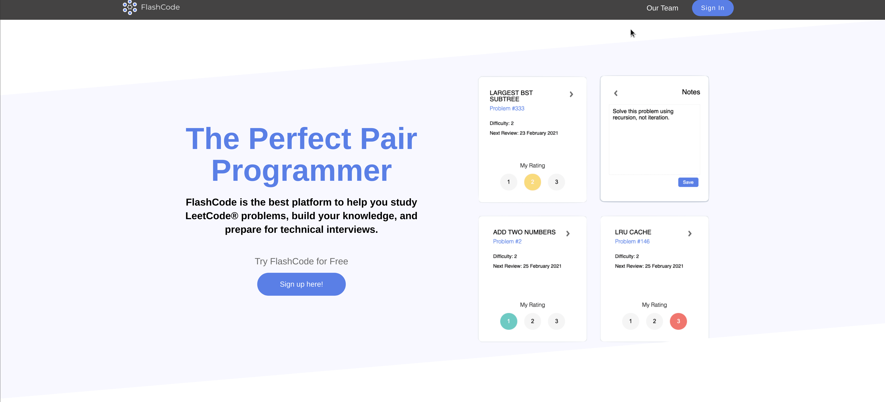
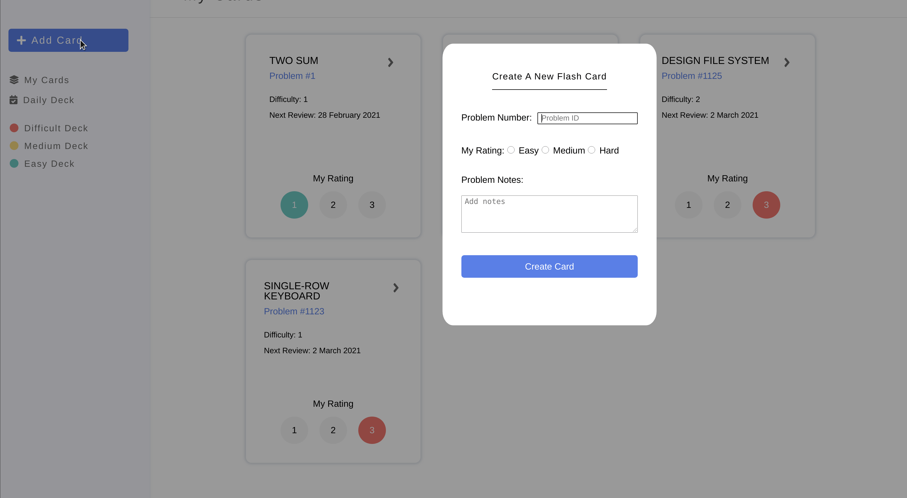
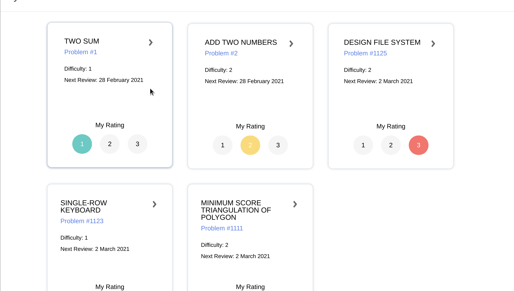

<!-- PROJECT SHIELDS -->
<!--
*** I'm using markdown "reference style" links for readability.
*** Reference links are enclosed in brackets [ ] instead of parentheses ( ).
*** See the bottom of this document for the declaration of the reference variables
*** for contributors-url, forks-url, etc. This is an optional, concise syntax you may use.
*** https://www.markdownguide.org/basic-syntax/#reference-style-links
-->

[![Contributors][contributors-shield]][contributors-url]
[![Stargazers][stars-shield]][stars-url]
[![Issues][issues-shield]][issues-url]
[![MIT License][license-shield]][license-url]

<!-- PROJECT LOGO -->
 

  
  <h3 align="center">Your Best LeetCode Buddy </h3>

  

  A flash card system with built-in spaced repitation function to help you retain your knowledge from LeetCode practices
     
     
    <a href="http://flashcode.herokuapp.com/#/">Start FlashCoding</a>
    ·
    <a href="https://github.com/caroger/flashcode/issues">Report Bug</a>
    ·
    <a href="https://github.com/caroger/flashcode/issues">Request Feature</a>
  

<!-- TABLE OF CONTENTS -->

  
Table of Contents

  <ol>
    <li>
      <a href="#about-the-project">About The Project</a>
      <ul>
        <li><a href="#built-with">Built With</a></li>
      </ul>
    </li>
    <li>
      <a href="#getting-started">Getting Started</a>
      <ul>
        <li><a href="#create-a-card">Create a Card</a></li>
        <li><a href="#take-notes">Take Notes</a></li>
        <li><a href="#review">Review</a></li>
      </ul>
    </li>
    <li><a href="#roadmap">Roadmap</a></li>
    <li><a href="#contributing">Contributing</a></li>
    <li><a href="#license">License</a></li>
    <li><a href="#contact">Contact</a></li>
  </ol>

<!-- ABOUT THE PROJECT -->

## About The Project

[![Product Name Screen Shot][product-screenshot]](http://flashcode.herokuapp.com/#)

There are many great flashcard and note taking apps available online, however, as a group of upcoming bootcamp graduates, we didn't find one that really suit our needs of preparing for the live coding interview, so we created one for ourselves. We want to create a flashcard system for aspiring software engineers and LeetCoders so amazing that it'll be the only one you ever need -- We think this is it.

Here's why:

- Your time should be focused more on solving algorithm problems and less on planning which to solve.
- You shouldn't be juggling multiple websites/apps to take notes and setup review schedules.
- FlashCode is the one and only reliable source you'll need to track your mastery of the LeetCode problems you've attempted.

### Built With

This project is built with:

- [MongoDB](https://www.mongodb.com/)
- [Express](https://expressjs.com/)
- [React](https://reactjs.org/)
- [NodeJS](https://nodejs.org/en/)

<!-- GETTING STARTED -->

## Getting Started

Head over to the [live site](http://flashcode.herokuapp.com/#) and click the Sign In button to log in, register, or test out FlashCode with a demo account.

### Create a card

Create a card by simply entering the corresponding leetcode problem number and give it a rating based on how confident you feel about solving the same problem in a interview setting:

   1. Totally going to ace it
   2. Will be able to solve it with some help
   3. Hard stuck

### Take notes

Flip over the card to write down any notes/tips you'd like to see when you review the same question in the future.

### Review

Based on your confidence rating and review history, we will prepare a "Daily Deck" for you to review. Your goal is to have your "Daily Deck" be empty at the end of the day!

1. Click on the Daily Deck button on left navbar to review problems due today
2. Cards that are way over-due will have a red shadow around their borders
3. Navigate to LeetCode via the URL on the card, finish and submit your solution on LeetCode, and comback to FlashCode to update your rating and notes.

<!-- ROADMAP -->

## Roadmap

See the [open issues](https://github.com/caroger/flashcode/issues) for a list of proposed features (and known issues).

<!-- CONTRIBUTING -->

## Contributing

Contributions are what make the open source community such an amazing place to be learn, inspire, and create. Any contributions you make are **greatly appreciated**.

1. Fork the Project
2. Create your Feature Branch (`git checkout -b feature/AmazingFeature`)
3. Commit your Changes (`git commit -m 'Add some AmazingFeature'`)
4. Push to the Branch (`git push origin feature/AmazingFeature`)
5. Open a Pull Request

<!-- LICENSE -->

## License

Distributed under the MIT License. See `LICENSE` for more information.

<!-- CONTACT -->

## Project Team

| |Role| Contacts|
| ------------- | ------------- | ----|
| Roger Hu|Project Lead | [![Roger Hu][linkedin-shield]](https://www.linkedin.com/in/rogerhu1989)[![Roger Hu][github-shield]](https://github.com/caroger)|
|Colin Eckert| Frondend Lead| [![Colin Eckert][linkedin-shield]](https://www.linkedin.com/in/colin-eckert/)[![Colin Eckert][github-shield]](https://github.com/colineckert)|
|Dongsoo Cha| Backend Lead| [![Dongsoo Cha][linkedin-shield]](https://www.linkedin.com/in/dongsoo-cha-72511476/)[![Roger Hu][github-shield]](https://github.com/chubbibanana/)|
|Edwin Zhou|Fullstack Engineer| [![Edwin Zhou][linkedin-shield]](https://www.linkedin.com/in/edwin-zhou-a231b31b6/)[![Edwin Zhou][github-shield]](https://github.com/ezhou0)|

<!-- MARKDOWN LINKS & IMAGES -->
<!-- https://www.markdownguide.org/basic-syntax/#reference-style-links -->

[contributors-shield]: https://img.shields.io/github/contributors/caroger/flashcode?style=for-the-badge
[contributors-url]: https://github.com/caroger/flashcode/graphs/contributors
[forks-shield]: https://img.shields.io/github/forks/othneildrew/Best-README-Template.svg?style=for-the-badge
[forks-url]: https://github.com/othneildrew/Best-README-Template/network/members
[stars-shield]: https://img.shields.io/github/stars/caroger/flashcode?style=for-the-badge
[stars-url]: https://github.com/caroger/flashcode/stargazers
[issues-shield]: https://img.shields.io/github/issues/caroger/flashcode?style=for-the-badge
[issues-url]:https://github.com/caroger/flashcode/issues
[license-shield]: https://img.shields.io/github/license/caroger/flashcode?style=for-the-badge
[license-url]: https://github.com/caroger/flashcode/blob/main/LICENSE
[linkedin-shield]: https://img.shields.io/badge/LinkedIn-0077B5?style=for-the-badge&logo=linkedin&logoColor=white
[github-shield]:https://img.shields.io/badge/GitHub-100000?style=for-the-badge&logo=github&logoColor=white
[product-screenshot]: images/screenshot.png
